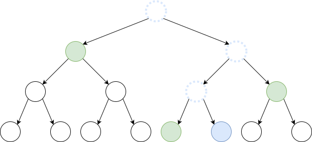

# Challenge 2

This challenge is designed as a remote message signature service using an unspecified post-quantum signature algorithm. As in challenge #1 some faults are injected within the computation at an unknown timing. The output signatures are somewhat large : 33584 bytes. Two binaries are provided for the challenge : one is the signing executable, and the other one is a signature verification.

## Identifying the algorithm

A signer binary and a signature verification binary are available together with the used public key. The signatures sent by the server are correctly verified using this public key with the verification binary.

Those executables are non-stripped 64 bits ELF binaries :

```shell
custom_algo_sign:       ELF 64-bit LSB shared object, x86-64, version 1 (SYSV), dynamically linked, interpreter /lib64/ld-linux-x86-64.so.2, for GNU/Linux 2.6.32, BuildID[sha1]=dd414f75f30f315f710d4838568b65122bdcfb15, not stripped

custom_algo_verify:     ELF 64-bit LSB shared object, x86-64, version 1 (SYSV), dynamically linked, interpreter /lib64/ld-linux-x86-64.so.2, for GNU/Linux 2.6.32, BuildID[sha1]=d49f8dcab4e18d1edc51eebb8427b208bbe68830, not stripped
```

Below is a list of some of the functions visible in the signer binary :

```
porsgensk
porssign
pruorstgenpk
sortsubset
octopruorstsign
octopruorstextract
octopruorstloadsign
octopruorstsigncmp
porsrandsubset
randombytes
cryptosignkeypair
cryptosign
...
```

A basic Google search did not yield any results. However, if we try splitting the words in each function name (e.g. "porsrandsubset" -> "pors rand subset") we end up in a GitHub repository which belongs to Kudelski : [https://github.com/gravity-postquantum/gravity-sphincs/](). Comparing the source code in this repository to the signer binary makes it clear that this is indeed the same algorithm and the same implementation, only with some renaming of various functions.

We now have identified the signature algorithm : it is Gravity-SPHINCS. This is a hash-based stateless signature algorithm created by Jean-Philippe Aumasson and Guillaume Endignoux, who both currently work at Kudelski. It is based on the SPHINCS algorithm which was designed in 2015 by D. Bernstein _et al_.  
We strongly recommend reading either G. Endignoux Master Thesis on the subject[<https://gendignoux.com/assets/pdf/2017-07-master-thesis-endignoux-report.pdf>] or simple implementations of Gravity-SPHINCS such as suggested in [<https://eprint.iacr.org/2017/933.pdf>] in order to fully understand the algorithm's internals. We will only detail mechanisms which are deemed absolutely necessary to understand and solve this challenge.


We recompiled the signer binary from the GitHub sources in order to validate the server's signatures and confirm our hypothesis, however this did not work. This is due to the many parameters, visible in the [Makefile](https://github.com/gravity-postquantum/gravity-sphincs/blob/master/Reference_Implementation/Makefile) :


```makefile
VERSION_S= -DPORS_k=24 -DMERKLE_h=5  -DGRAVITY_d=1  -DGRAVITY_c=10
VERSION_M= -DPORS_k=32 -DMERKLE_h=5  -DGRAVITY_d=7  -DGRAVITY_c=15
VERSION_L= -DPORS_k=28 -DMERKLE_h=5  -DGRAVITY_d=10 -DGRAVITY_c=14
```

The server's parameters are easily found through reverse-engineering :

```makefile
VERSION_CTF = -DPORS_k=32 -DMERKLE_h=5  -DGRAVITY_d=7 -DGRAVITY_c=0
```

This time, the signatures generated by our recompiled binary are checked out by the signature verification binary and we can move on to the next step.

## Fault injection in Gravity-SPHINCS

Gravity-SPHINCS signatures have four parts :

```c
struct gravity_sign {
    struct hash rand;                            /* offset 0-0x20 */
    struct octoporst_sign op_sign;               /* offset 0x20-0x4430 */ 
    struct merkle_sign merkle[GRAVITY_d];        /* offset 0x4430-0x8330 */
#if GRAVITY_c > 0
    struct hash auth[GRAVITY_c];
#endif
};
```

In the challenge's case `GRAVITY_c` is 0, meaning only the struct members `rand`, `op_sign` and `merkle` are used.

Below is the `merkle_sign` structure definition :

```c
struct merkle_sign {
  struct wots_sign wots;                   /* 67 * 32 */
  struct hash auth[MERKLE_h];              /* 5 * 32 */
};
```

Now that we have Gravity-SPHINCS' signature structure in mind we can slice the server's signatures and spot where the fault was injected. By retrieving several same-message signatures one can see that the first difference always occurs in the `auth` field of the `merkle_sign` structure. Looking at the code it appears this field is computed by the `merkle_gen_auth` function. What can we extract from this ?

The `merkle_sign` structure contains a list of Winternitz One-Time Signatures and a Merkle authentication path.

### Winternitz One-Time Signatures (WOTS)

The Winternitz One-Time signature was proposed as an upgrade to Lamport Signatures by Robert Winternitz in an article published by Ralph Merkle in 1989. This scheme is rather simple.
In order to sign an $n$-bit long message, one chooses two parameters $l$ and $w$ such that $l \cdot \log_2(w)=n$. The secret key is represented as $l$ strings of $n$ bits $(s_1, \ldots, s_l)$. The public key is computed by applying a one-way function $w-1$ times to every string in the secret key : $(F^{w-1}(s_1),\ldots,F^{w-1}(s_l))$.

Signature verification consists in applying $w-1-x_i$ times $F$ to each signature element and verifying that each result matches the corresponding public key.


In those conditions an attacker may sign any message of his choosing with an $x_{i'}>x_i$ : it is sufficient to apply $F$ to $x_i$, $(x_{i’} - x_i)$ times. This attack can be prevented by adding a checksum to the message to be signed : $C(x) = \sum_{i=1}^{l}(w-1-x_i)$. This checksum is itself signed. The complete signed message is actually $x'=x\Vert C(x)$. If an attacker replaces one of the $x_i$ by $x_{i'}$ with $x_{i’} > x_i$ then the checksum will be less than its expected value and it will no longer be possible to sign it.

The one-way function used by Gravity-SPHINCS is Haraka-v2-256 [<https://eprint.iacr.org/2016/098>], and as for the other parameters : $n = 256$, $l = 64$ and $w = 16$. The checksum is encoded over 3 words of $\log_2(w)$ bits. WOTS secret keys are made of 64 + 3 strings of length 256 bits, each of those signing 4 bits of the message.

### Merkle trees

Merkle trees are a particular kind of binary trees of size *h*. Each nodes' value lies in the set $\{0, 1\}^n$ and depends on its childs values $b$ and $c$ : $a = H(b \Vert c)$ where $H$ is a hash function $\{0,1\}^{2n} \rightarrow \{0,1\}^n$.

This construct is used to sign a vast amount of messages from Winternitz One-Time signatures described in the previous section. One can build a tree of height $h$ whose leaves represent a WOTS public key each. The public key of the tree is its root value.

Signing a message with the $i-th$ index in the tree requires signing with the $i-th$ instance of WOTS and broadcasting the signature together with its authentication path in the tree. This path allows checking the WOTS public key that was used. If we trace back the path between the $i-th$ leave and the root of the tree, the authentication path is a graph made from all the neighbours of this path. Those neighbours allow going back up to the root and compare its value to the broadcast public key.

For example, in the figure below, the authentication path for the blue node is composed of all the green nodes.



Several Merkle trees are necessary in Gravity-SPHINCS. They form what is called a hyper-tree : a tree whose leaves are Merkle trees themselves. The public key of this hyper-tree is the public key of the root Merkle tree. Each node's child is a tree signed with a WOTS signature from the corresponding parent root.


As the last step, the hyper-tree leaves are used to sign the message (those sign the public keys of a so-called few-time signature scheme named PORS which is specific to Gravity-SPHINCS).

A noticeable difference between SPHINCS and Gravity-SPHINCS is the possibility to cache the root node. This feature is unused in the challenge at hand.

### Fault injection

What happens when a fault is injected during a signature computation, especially during the authentication path computation ? With Gravity-SPHINCS signatures are deterministic : signing several times the same message under the same private key will always yield the same result.

<!-- A WOTS instance can only sign a single message. This fact allows guaranteeing the signature scheme's security. -->

When a fault actually occurs, a *different* message will be signed with the original message's WOTS instance. As a surprising revelation, the Winternitz one-time signature cannot uphold its security guarantees when it is not used to, well, sign a message only once. By forcing the signer to sign several times the same message through faults, we can retrieve all secret values of a WOTS instance.


A fault injection attack on SPHINCS and variants is described in [Grafting Trees: a Fault Attack against the SPHINCS framework](https://eprint.iacr.org/2018/102.pdf). Another faut attack was published in [Practical Fault Injection Attacks on SPHINCS](https://eprint.iacr.org/2018/674.pdf) but its generalization and application to Gravity-SPHINCS did not strike us. It appears we have used the more direct method described in the first reference (paragraph "3.3.1 Total break on WOTS") without prior knowledge of its publication (CTF conditions being mostly incompatible with reading academic papers). This attack, among all presented in the paper, is the one that requires the largest amount of faulted signatures. After solving the challenge we took some time to read the first reference and came to the realization that there were other variants requiring fewer faults, or even just a single one.

## Attack

### Principle

The frist step will be requesting the server to sign the same message a number of times. The server will either issue the correct and expected signature or a signature on a faulted input in one of the layers of the Merkle tree.

By repeating the process we will gather differing signature results corrsponding to differing input messages but still signed by the same WOTS instance. We consider those messages  $(x_1, x_2, .., x_{l-1})$ to be uniformly taken at random ($x_l$ is discarded to make things simpler, as it equals 1 with high probability). Each $x_i$ value will be 0 with a probability of $1/16$. Signing a zero-valued $x_i$ will give us the private key associated to $s_i$. Using several other messages signed by the same WOTS instance, we get all the $s_i$.

Finding the private key with $n$ faulty messages on an identical WOTS instance has probability :

$$\left(1 - \left(\frac{w-1}{w}\right)^n\right)^{l-1}$$

which in our case corresponds to  

$$\left(1 - \left(\frac{15}{16}\right)^n\right)^{66}$$  

71 messages are enough to completely break a WOTS signature with ~50% chances of succeeding, and thereby gain the ability to sign any message.


Once we get hold of the WOTS key, we can attach an arbitrary tree to the original hyper-tree and sign it with this key. At this point we can forge a signature for any message on behalf of the targeted Gravity-SPHINCS instance, under one condition : that the message we want to sign has a few-time signature index that belongs to our freshly attached tree. Fortunately, our message is prepended with some data of our own choosing, and this data affects the path taken in the hyper-tree. By modifying this data we can actually force the signature to be performed under our attached tree, and therefore forge the signature of any given message (see implementation referenced below).
This search can be performed completely offline. Furthermore the Octopus authentication tree (which was not mentioned until now for simplicity) is reconstructed from those random data, and also needs to be valid.

Empirically we measured the likelihood to generate a valid Octopus tree to be about $1/18$. There are 32 possible indices for the few-time signature. Therefore we can get a seed for the correct signature of a message after $2^{9.17}$ iterations.

### Implementation

We have rewritten a complete implementation of Gravity-SPHINCS in Python in order to quickly prototype our attacks. A Haraka implementtion in Python previously developped for last year's Kudelski challenge was initially used but proved to be too slow for our use. We used C bindings to the script from Python instead.

A first script gathers signatures form the server for a given message and keeps a list of the ones which were faulted at a specific layer of the tree (we chose the one before the last layer). The server generates a fault at a rate of one out of two signatures. The layer in which the fault is introduced is random. $7 \times 2$ server requests are necessary on average to get a useful faulty signature.


A second script browses through the list of signatures returned by the first script and determines whether it is possible to retrieve the full key for the specified layer.

We requested 1310 signatures from the server. Among those, 654 were faulted, and a subset of 80 of those were faulted in the targeted layer. In the end, 67 signatures were enough to retrieve the secret key.

The flag for this challenge :

```shell
$ python get_flag.py
Private key recovered with 67 faulted signatures.
CTF{b3c4u53 7h3r3 15 4 l4w 5uch 45 6r4v17y, 7h3 un1v3r53 c4n 4nd w1ll cr3473 1753lf fr0m n07h1n6}
```
